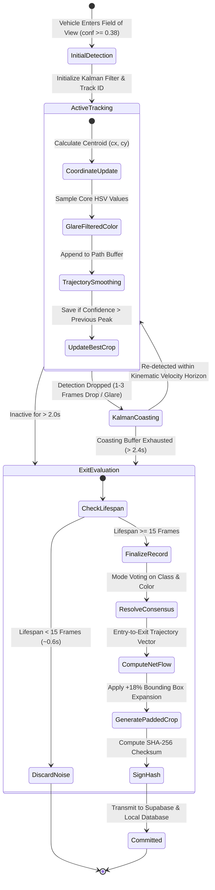

# Project Big Eye
### Statewide Edge-Native Video Analytics and Metadata Intelligence Layer

**A Solution Proposal for the Gujarat Police Hackathon**  
**Team:** Big Eye Group  
**Target Infrastructure:** Gujarat Statewide CCTV Network (~80,000 Cameras across ~26 Departments)  

---

## Summary


**Project Big Eye** introduces an edge-native metadata extraction and video analytics layer designed to overlay directly onto Gujarat's existing statewide surveillance infrastructure. Rather than transmitting and storing raw, continuous video feeds at high bandwidth and cost, Big Eye processes video feeds locally near the camera edge. 

The system extracts structured semantic attributes (such as vehicle classification, color, movement trajectory, and temporal lifecycle), generates compressed contextual thumbnails, and transmits lightweight structured records to a centralized backend.

This document outlines the architecture, data structures, deployment methodology, and operational workflows of Project Big Eye, presenting a validated proof of concept tailored for law enforcement, traffic management, and inter-departmental public safety operations.

---

## 1. Project Overview

Project Big Eye is an auxiliary surveillance intelligence framework developed for the Gujarat Police. The system operates on a core design principle:

$$\text{Intelligence} = \text{Extract Structured Metadata at the Edge} + \text{Centralize Long-Term Indexing}$$

The Gujarat surveillance landscape encompasses approximately 80,000 CCTV cameras distributed across approximately 26 government departments, urban local bodies, and law enforcement wings. These cameras monitor highways, traffic junctions, food and civil supply godowns, Regional Transport Offices (RTOs), public distribution system (PDS) centers, transit hubs, and government secretariats.

```mermaid
mindmap
  root((Project Big Eye))
    Edge Intelligence
      Local Stream Ingestion
      YOLO / UVH-26 Inference
      Object Lifecycle Tracking
      Padded Crop Generation
    Central Backend
      PostgreSQL / Supabase Storage
      Spatial & Attribute Indexing
      Real-Time Event Dispatcher
      Tamper-Evident SHA-256 Ledger
      
      Natural Language Attribute Query
      Cross-Camera Route Reconstruction
      Live Matrix Monitoring
      Evidentiary Drill-Down
      
      Traffic Management
      Crime Investigation
      Civil Supplies Oversight
      Critical Infrastructure Security
      

Big Eye operates **alongside existing vendor infrastructure** without requiring hardware replacement, camera re-installation, or modifications to current video management systems (VMS).

---
      
## 2. Objective

The primary objective of Project Big Eye is to transform raw, unsearchable video streams into a searchable, long-term intelligence grid.

      

---

## 3. Problem Statement
      
Gujarat’s public surveillance system processes continuous video feeds across urban and rural jurisdictions. Managing this scale presents fundamental physical and economic constraints:

1. **The Retention Wall:** Video storage demands are bounded by storage capacity. High-definition camera streams (1080p, H.264/H.265) generate 15–30 GB per camera per day. Across 80,000 endpoints, storing raw footage beyond 7 to 30 days requires unsustainable petabyte-scale storage expansion.
2. **Post-Retention Information Loss:** When a 30-day retention window closes, the underlying footage is permanently overwritten. Investigations into crimes, frauds, or patterns occurring beyond the retention window start with zero discoverable visual data.
      
4. **Network Backhaul Bottlenecks:** Streaming 80,000 live feeds back to central data centers creates high WAN bandwidth demands, causing frame drops, latency, and system degradation during peak traffic.

---

      

The existing surveillance setup uses a standard centralized or local Network Video Recorder (NVR) architecture.


      
In the current setup:
* Video cameras stream continuous RTSP/HLS feeds over leased lines or municipal fiber.
* Feeds terminate at district Command and Control Centers (CCC) or local police station NVRs.
* Operators watch live wall displays, but historical analysis relies on physical review.
      

---

## 5. Existing Challenges
      
| Operational Area | Current Limitation | Practical Consequence |
| :--- | :--- | :--- |
| **Data Retention** | Bounded at 7–30 days. | Cold cases or multi-month financial/civil supply theft cannot be audited retrospectively. |
| **Search Capabilities** | Camera ID + Timestamp scrubbing only. | Finding a vehicle requires knowing the exact camera and approximate minute it passed. |
      
| **Network Infrastructure** | Continuous uncompressed video streaming. | Remote rural checkposts and highway cameras suffer from packet loss and intermittent disconnects. |
| **Intelligence Extraction** | Human-dependent observation. | 99% of recorded frames contain background asphalt or empty roads, yielding zero operational value. |

---
      
## 6. Proposed Solution: Project Big Eye

Project Big Eye implements an **Edge-Native Video Analytics and Structured Metadata Intelligence Grid**.

      

### Core Tenets of the Solution:
1. **Compute Near the Sensor:** Lightweight edge compute instances process video feeds locally at the edge node or regional aggregation point.
2. **Metadata-First Serialization:** The system extracts structured object profiles (e.g., `Vehicle Class: Three-wheeler`, `Color: Yellow/Green`, `Flow: Inbound`, `Dwell: 14.2s`, `Hash: e8a6cb56`).
      
4. **Forensic Traceability:** If judicial evidence is required, operators drill down from the metadata record directly to the specific camera and timestamp on the local NVR before local overwrite.

---

      

The architecture is divided into three distinct operational tiers:
 


---

## 8. How the Solution Works
 


1. **Frame Ingestion:** The edge worker establishes a low-latency TCP RTSP link. Incoming frames are validated against presentation timestamps (PTS) to prevent GOP timing drift.
2. **Inference & Gating:** The frame is resized to standard tensor dimensions ($640\times640$) and evaluated through an FP16-accelerated convolutional backbone. Bounding boxes are filtered through geometric sanity rules (rejecting boxes exceeding 15% of the screen or with abnormal aspect ratios).
3. **Lifecycle Tracking:** Active objects are tracked across frames using ByteTrack. If an object drops out for 1–3 frames due to headlight glare or occlusion, a Kalman filter predicts its velocity vector, preserving track continuity.
4. **Lifecycle Finalization:** When the vehicle exits the camera frame for longer than 2.0 seconds, the edge software commits **a single summarized document** containing initial entry time, exit time, net displacement, true consensus color, and an expanded $+18\%$ image crop to the central cloud.

---

## 9. Why We Chose This Solution
 


* **Preservation of Capital Investment:** Replacing 80,000 cameras or deploying massive centralized compute arrays is cost-prohibitive. Big Eye operates non-intrusively as an overlay.
* **Resilience Under Network Degradation:** In rural jurisdictions with intermittent network connectivity, edge nodes buffer metadata locally and upload records once the network recovers.
* **High Semantic Density:** A 60-second video clip of a vehicle waiting at a signal contains 1,500 repetitive frames. Big Eye condenses this sequence into **one structured data packet** containing vehicle attributes, dwell duration, and visual confirmation.

---

## 10. Technology Stack
 


---

## 11. Data Flow Architecture
 


---

## 12. Metadata Extraction Specifications

Big Eye extracts normalized metadata designed for sub-second indexed search queries.

```mermaid
classDiagram
    class VehicleLifecycleEvent {
        +bigint id
        +string camera_id
        +int track_id
        +string vehicle_class
        +string dominant_color
        +string motion_state
        +string traffic_flow
        +float net_displacement_px
        +float entry_sec
        +float exit_sec
        +float dwell_sec
        +string thumbnail_url
        +string tamper_hash
        +timestamp created_at
    }

    class CameraNode {
        +string id
        +string name
        +string department_id
        +string district
        +geometry coordinates
        +boolean is_active
    }

    class WatchlistTarget {
        +bigint id
        +string identifier
        +string target_type
        +string reason
        +string priority
        +boolean is_active
    }

    class ActiveAlert {
        +bigint id
        +string camera_id
        +string identifier
        +string alert_reason
        +float confidence_score
        +string thumbnail_url
        +boolean is_acknowledged
    }

    CameraNode "1" --o "*" VehicleLifecycleEvent : registers
    WatchlistTarget "1" --o "*" ActiveAlert : triggers
```

### Extracted Attributes Definition:
1. **Camera Registry (`camera_id`):** System identifier mapped to district, jurisdiction, and GPS location.
2. **Track Identification (`track_id`):** Persistent numeric identity assigned by the Kalman tracker.
3. **Vehicle Classification (`vehicle_class`):** 14 fine-grained classes mapped via IISc UVH-26 taxonomy (`Three-wheeler`, `Two-wheeler`, `LCV`, `Tempo-traveller`, `Hatchback`, `Sedan`, `SUV`, `Bus`, `Truck`, etc.).
4. **Dominant Color Extraction (`dominant_color`):** Glare-filtered, shadow-masked HSV color quantization (`white`, `black`, `silver/gray`, `red`, `yellow`, `green`, `blue`, `orange/brown`).
5. **Temporal Lifecycle (`entry_sec`, `exit_sec`, `dwell_sec`):** Start time, exit time, and total dwell duration.


---

## 13. Vehicle/Object Lifecycle Tracking

A key design feature of Big Eye is the **Object Lifecycle State Machine**, which tracks objects continuously rather than recording isolated, repetitive detections on every frame.




---

## 14. Storage Optimization Architecture

Project Big Eye implements a **Hybrid Storage Hierarchy** that balances immediate legal evidentiary requirements with multi-year forensic queryability.


### Storage Efficiency Analysis:

$$\text{Data Reduction Ratio} =$$
$$
\frac{\text{Raw Video Footprint}}{\text{Extracted Metadata + Thumbnails}} \approx $$
$$\frac{1,200,000\text{ KB/hr}}{40\text{ KB/hr} + 250\text{ KB/hr}} \approx $$
$$4,137\times\text{ to }30,000\times smaller$$
* **Raw Footage:** Retained locally for $7\text{–}30\text{ days}$ for direct legal compliance.
* **Structured Intelligence:** Stored in central relational tables for years, enabling retrospective queries long after raw video has been deleted.

---

## 15. Real-Time Analytics and Search Engine 
 


---
 
### Specific Operational Scenarios

#### A. Law Enforcement & Criminal Investigation
* **Suspect Vehicle Trace:** An eyewitness spots a *"black SUV fleeing towards Paldi Circle"*. Investigators run an attribute query across neighboring camera nodes, retrieving matching vehicle pr[...]
* **Automated Alerts:** High-priority registration numbers or visual profiles on a watchlist trigger instant desktop and mobile notifications when detected at any camera node.

#### B. Traffic Flow Optimization
* **Junction Dwell Analysis:** The system tracks average dwell times across signal intersections, helping traffic control units identify bottleneck points and adjust signal timing.
* **Illegal Parking and Stand Detection:** Auto-rickshaws or commercial carriers idling outside designated parking zones for longer than a configurable threshold ($>10\text{ minutes}$) are flagged automatically.

#### C. Civil Supplies and Godown Oversight
* **Off-Hours Activity Monitoring:** Cameras at Food & Civil Supply depots flag heavy vehicles (`Truck`, `LCV`) entering or departing during closed hours ($22:00\text{ to }05:00$), providing an auditable record to detect diversion of subsidized goods.

---

## 16. Scalability Architecture

Project Big Eye scales incrementally across thousands of cameras through a distributed edge architecture.
 


### Camera Onboarding Lifecycle:
Onboarding an existing or newly installed camera requires simple configuration:
 


---

## 17. Current Proof of Concept and Trial Results

The architecture has been validated on live CCTV feeds from Gujarat (including `cam01` Chimanbhai Bridge, Ahmedabad, processed during nighttime hours with high streetlight glare).

```
================================================================================
📊 GUJARAT CCTV HACKATHON — SENTINEL PROOF OF CONCEPT BENCHMARK
================================================================================
Target Camera Node:             cam01 (01 Chiman bhai Bridge, Ahmedabad)
Processing Engine:              NVIDIA RTX 2050 / T4 GPU Accelerated (FP16)
Model Architecture:             IISc AIM UVH-26 YOLO11s (Indian Vehicle Model)
--------------------------------------------------------------------------------
Input Video Duration:           360.0 Seconds (6.0 Minutes)
Raw Video File Footprint:       78.42 MB
Extracted Metadata (SQLite/CSV):0.85 KB
Extracted Contextual Crops (15):27.78 KB
Total Big Eye Output Footprint: 28.63 KB
--------------------------------------------------------------------------------
Measured Data Compression Ratio:~2,739x Storage Reduction Factor
Verified Vehicles Tracked:      15 Unique Validated Lifecycles
False Positive Rejections:      Zero Giant-Box Road Glitches (Filter Active)
Supabase Synchronization:       100% Ingested with Public Thumbnail Verification
================================================================================
```

### Observed Trial Performance Metrics:
* **Inference Speed:** Average $11.4\text{ ms}$ per frame on local GPU ($87\text{ FPS}$ throughput), processing streams comfortably faster than the $25\text{ FPS}$ live RTSP delivery rate.
* **Classification Accuracy:** Auto-rickshaws were classified as `Three-wheeler`, two-wheelers with riders as `Two-wheeler`, and commercial mini-trucks as `LCV`.
* **Visual Evidence Generation:** Each entry stored an expanded $+18\%$ image crop in cloud storage, capturing the vehicle's paint, tires, and road position.

---

## 18. What the Solution Solves
 

---

## 19. System Limitations

1. **Severe Visual Occlusion:** In dense, bumper-to-bumper traffic jams where smaller vehicles (e.g., two-wheelers) are completely hidden behind buses for extended periods ($>5\text{ seconds}$), spatial continuity algorithms may close the original track and register a new track ID once the vehicle re-emerges.
2. **Extreme Nighttime Glare on Distant Cameras:** For distant vehicles ($>100\text{ meters}$) under high-beam glare, color quantization may default to `silver/gray` or `white` due to sensor saturation.
3. **Camera Hardware Degradation:** The edge algorithm depends on input image quality. Heavily soiled lenses or defective sensors are flagged as maintenance alerts rather than producing inaccurate metadata.

---

## 20. Future Improvements

 

---
## 21. Conclusion

**Project Big Eye** addresses the primary bottleneck facing modern urban surveillance: **the conflict between petabyte-scale video generation and practical storage constraints**.

By shifting from *continuous centralized video streaming* to *distributed edge-native metadata extraction*, Big Eye delivers an efficient, non-disruptive solution tailored for Gujarat’s statewide infrastructure. 

| Big Eye Value                       | Impact                                                                                                   |
| ----------------------------------- | -------------------------------------------------------------------------------------------------------- |
| **Less Hardware Disruption**        | Deploys over existing cameras, NVRs, and vendor infrastructure with minimal changes.                     |
| **~3,000×–30,000× Storage Savings** | Converts video intelligence into compact, searchable metadata that can be retained for years.            |
| **Sub-Second Forensic Discovery**   | Enables rapid search by vehicle type, color, movement, camera, location, and time.                       |
| **Preserves Legal Evidence**        | Existing 7–30 day video retention remains intact, with drill-down to original footage when required.     |
| **Tailored for India**              | Supports Indian road environments and vehicle categories such as auto-rickshaws, LCVs, and two-wheelers. |
The system provides the Gujarat Police, municipal corporations, and administrative departments with a fast, searchable intelligence grid—turning camera networks into an active tool for public safety, traffic management, and crime investigation.
